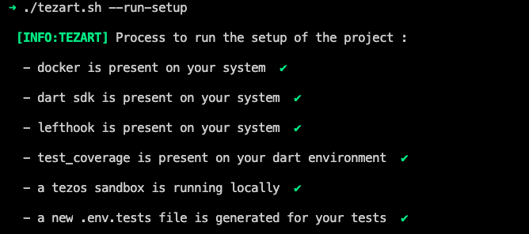
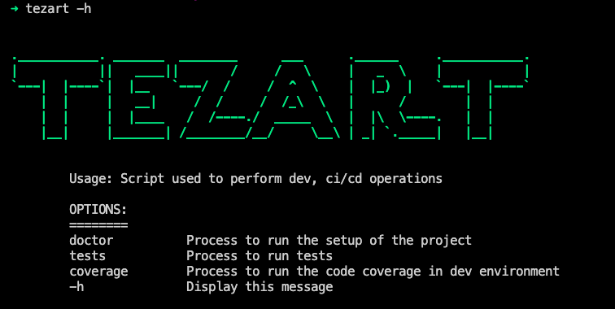

<table style="width:100%">
  <tr>
    <th>License</th>
    <th>Github Action - Tests</th>
    <th>Coverage with codecov.io</th>
  </tr>
  <tr>
    <td>
        <a href="https://github.com/moneytrackio/tezart/blob/main/LICENSE" target="_blank">
           
        </a>
    </td>
    <td>
        <a href="https://github.com/moneytrackio/tezart/actions?query=workflow%3A%22Run+tests%22" target="_blank">
            
        </a>
    </td>
    <td>
        <a href="https://codecov.io/gh/moneytrackio/tezart" target="_blank">
            
        </a>
    </td>
  </tr>
</table>

# tezart

A dart library that connects to interact with the tezos blockchain. 
It connects to a tezos node to send transactions, interact with smart contracts.

## Features 

wip

## TODO 

wip

## Usage

wip

## Contribution

### Setup your development environment [ for Mac and Linux ]

**Tezart** is a [dart](https://dart.dev/) package that will help your applications to interact with the tezos blockchain.

To ensure that you can contribute to this project, you will need to setup your environment with the installation of the following tools : 

- [dart sdk for package development](https://dart.dev/get-dart)
- [docker for local testing](https://docs.docker.com/get-docker/)
- [lefthook to our git hooks](https://github.com/Arkweid/lefthook)

#### A. Dart SDK for Package development

You can install **Dart SDK**, by following the [official dart documentation](https://dart.dev/get-dart)
#### B. Docker to run a tezos sandbox locally

1- If you don't have **Docker**, please install it by following the [official docker documentation](https://docs.docker.com/get-docker/)

2- If you have **Docker**, You will need a running blockchain on your local environment to launch the tests. You can use [tqtezos's sandbox](https://assets.tqtezos.com/docs/setup/2-sandbox/) by running the following command : 

```
docker run --rm \
    --name my-sandbox \
    --detach -p 20000:20000 \
    tqtezos/flextesa:20201214 delphibox start
```

#### C. Setup Lefthook

To install lefthook, just follow [this](https://github.com/Arkweid/lefthook/blob/master/docs/full_guide.md#installation) guide, then run :

```sh
lefthook install
```

#### Verify your setup 

To ensure that your environment is ready for contribution, please run the following command at the root of the project: 

```sh
./tezart doctor
```

You can add an alias like this `alias tezart='./tezart'` to avoid  calling the command line with `./`
 
Following is a sample of a correct setup :



### Utility functions

We provide some utility functions through `tezart` to help you in your development process. 

Following is the output usage : 



## Feature requests and bugs 

If you want to contribute to this project, please fork the project and submit your pull request. 
Feature requests and bugs at the [issue tracker](https://github.com/moneytrackio/tezart/issues/new)
