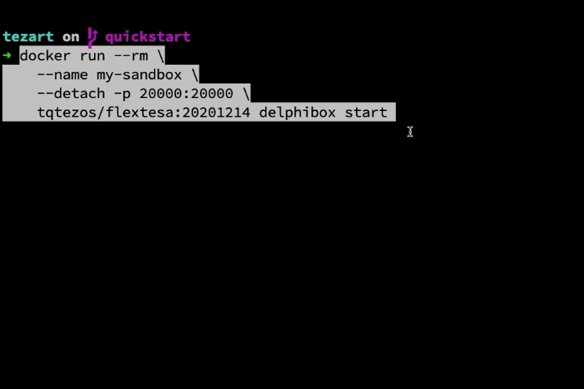

# Tezart

> A library for building decentralized applications in [dart language](https://dart.dev/), currently focused on the [Tezos](http://tezos.com/) platform.

## What it is 

[Tezart](https://github.com/moneytrackio/tezart) connects to interact with the Tezos blockchain. 

It connects to a tezos node to send transactions, interact with smart contracts and much more !

See the [Quick start](#quick-start) guide for more details.

## Links

- [Documentation](https://moneytrackio.github.io/tezart/)
- [Contribution](https://moneytrackio.github.io/tezart/#/?id=contribute)
- [API Reference]()

## Quick Start

Look at this [example](https://moneytrackio.github.io/tezart/?id=examples)

## Feature requests and bugs 

If you want to contribute to this project, read the [code of conduct](CONTRIBUTING.md#code-of-conduct)

Feature requests and bugs at the [issue tracker](https://github.com/moneytrackio/tezart/issues/new)

## License

[MIT](https://github.com/moneytrackio/tezart/blob/main/LICENSE)